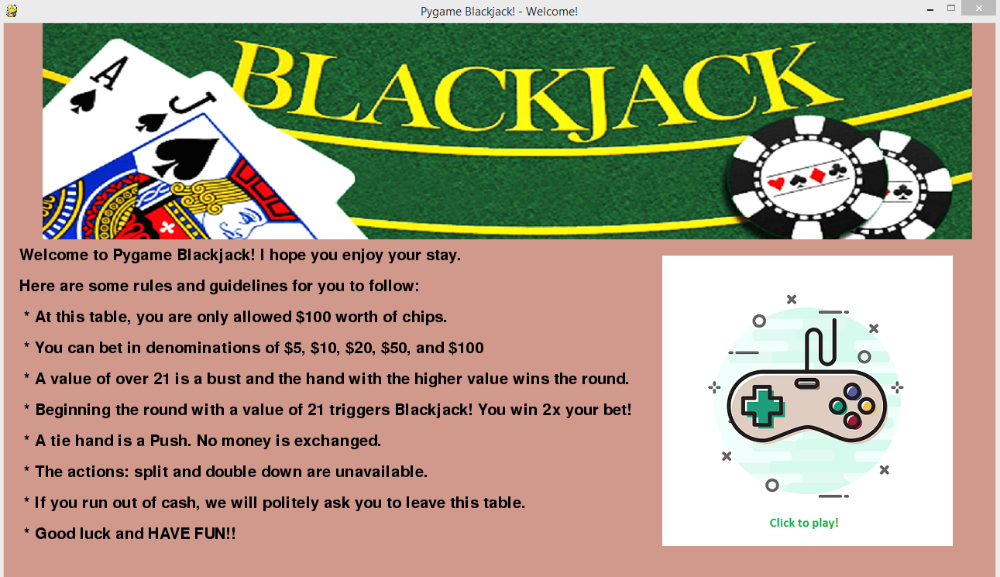
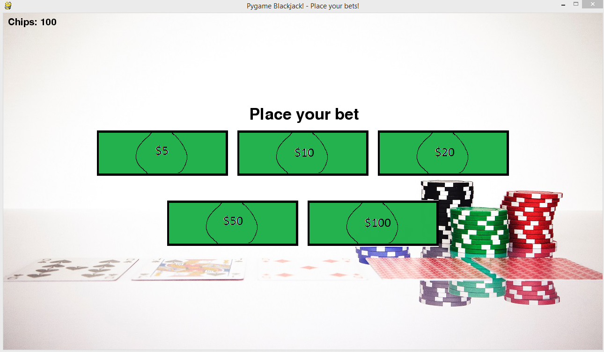
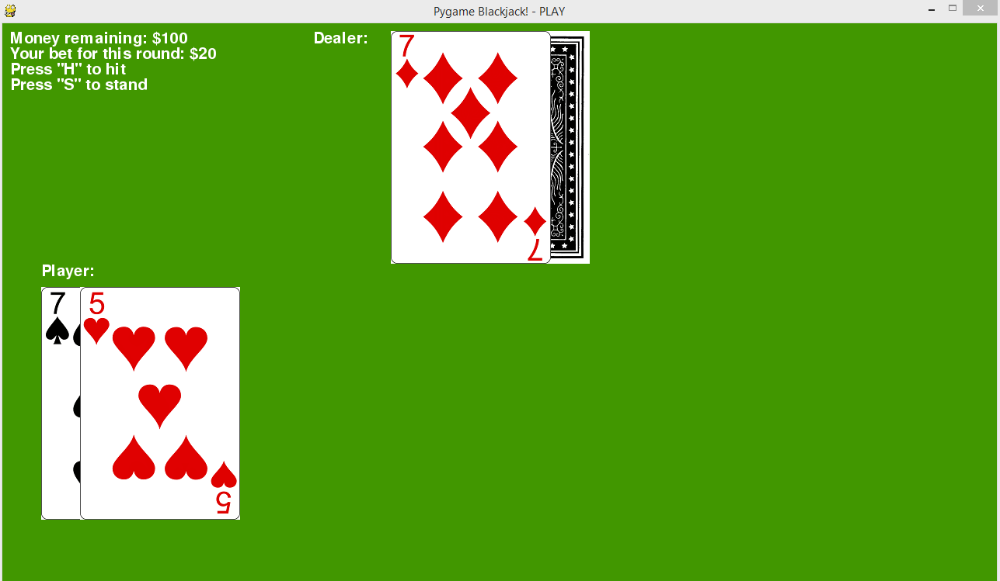
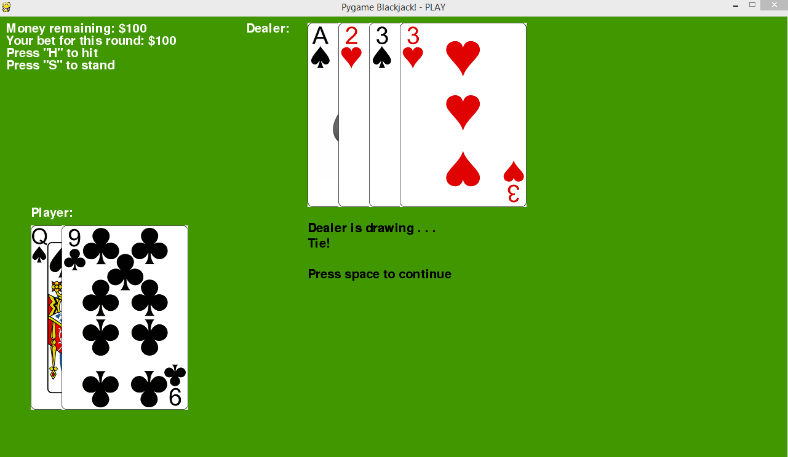
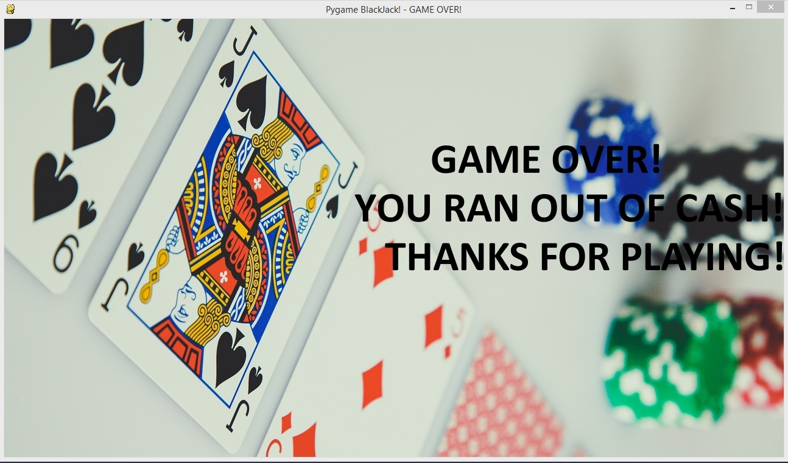

# Introduction
I was inspired to take my text-based Blackjack game that I wrote to the next level and re-wrote the game using Pygame. Originally, the game was only played in the terminal, but with the Pygame library, I'm able to create the game in 2D.
# Gameplay
So to begin, make sure you have the pygame library installed. If you haven't already, you can run ``pip install pygame``.
When the game is initialize, this is the first screen that shows up.

Essentially, it's the instructions on the left, the play button on the right.

When the player is ready to begin, press the play button on the right. The betting stage begins. 
I made the bills using Paint because there's a certain amateur charm to the whole thing. I hope it didn't come out too bad.

With bets taken, the game is finally underway. Here is a screenshot. 
Instructions are on the top left and both oppositions' hands are on the field.

One thing I realized while testing the game rigorously is the speed of the dealer's turn. After the player finishes their turn with a 'S' command to stand, it's as though the dealer's turn happen instantaneously. I remedy this using the sleep() function by importing the time library. 
This adds suspense to the game.

Finally, last but not least, what happens when the player runs out of cash? Well, it's game over.  The player would have to close the window and relaunch the game to play again. 
I could implement a function that asks the player if they would like to replay, but this way stays true to a gambling scenario. If they run out of money, they shouldn't be able to gamble anymore.
